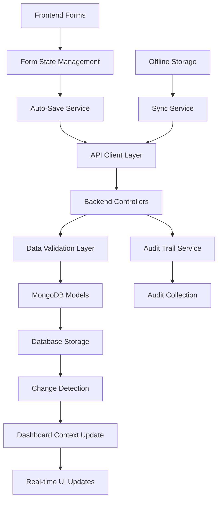

# Design Document

## Overview

This design addresses comprehensive data persistence gaps in the ESG platform by implementing systematic data flow validation, enhanced save mechanisms, real-time dashboard updates, and robust audit trails. The solution ensures all user-entered data across ESG modules (B0-B11, C1-C9) is properly persisted to MongoDB and immediately reflected in the dashboard interface.

The current system has partial data persistence implementation with some modules (B0, B3, B8) having basic save functionality, while others lack proper database integration. This design provides a unified approach to data persistence across all modules.

## Architecture

### High-Level Data Flow Architecture



### System Components Overview

1. **Frontend Layer**: Enhanced form components with auto-save capabilities
2. **State Management**: Centralized dashboard context with real-time updates
3. **API Layer**: Standardized endpoints for all ESG modules
4. **Backend Services**: Unified data persistence and validation
5. **Database Layer**: Optimized MongoDB schemas with audit trails
6. **Sync Services**: Offline capability and conflict resolution

## Components and Interfaces

### 1. Enhanced Form Components

#### Auto-Save Form Wrapper
```typescript
interface AutoSaveFormProps {
  moduleId: string;
  reportId: string;
  data: any;
  onSave?: (data: any) => void;
  saveInterval?: number; // milliseconds
  children: React.ReactNode;
}

interface SaveState {
  status: 'idle' | 'saving' | 'saved' | 'error';
  lastSaved?: Date;
  error?: string;
}
```

#### Form Field Components
```typescript
interface ESGFormFieldProps {
  name: string;
  value: any;
  onChange: (value: any) => void;
  validation?: ValidationRule[];
  required?: boolean;
  autoSave?: boolean;
}
```

### 2. Data Persistence Service

#### Module Data Manager
```typescript
interface ModuleDataManager {
  saveModuleData(moduleId: string, reportId: string, data: any): Promise<SaveResult>;
  loadModuleData(moduleId: string, reportId: string): Promise<any>;
  validateModuleData(moduleId: string, data: any): ValidationResult;
  getModuleCompletionStatus(moduleId: string, reportId: string): Promise<CompletionStatus>;
}

interface SaveResult {
  success: boolean;
  data?: any;
  error?: string;
  timestamp: Date;
  auditId?: string;
}
```

#### Auto-Save Service
```typescript
interface AutoSaveService {
  enableAutoSave(moduleId: string, reportId: string, interval?: number): void;
  disableAutoSave(moduleId: string): void;
  forceSave(moduleId: string): Promise<SaveResult>;
  getPendingChanges(moduleId: string): any;
  clearPendingChanges(moduleId: string): void;
}
```

### 3. Backend API Standardization

#### Unified Module Controller Interface
```typescript
interface ModuleController {
  getModule(req: Request, res: Response): Promise<void>;
  updateModule(req: Request, res: Response): Promise<void>;
  validateModule(req: Request, res: Response): Promise<void>;
  calculateMetrics(req: Request, res: Response): Promise<void>;
  getCompletionStatus(req: Request, res: Response): Promise<void>;
}
```

#### Standardized API Endpoints
```
GET    /api/reports/:reportId/:moduleId
PUT    /api/reports/:reportId/:moduleId
POST   /api/reports/:reportId/:moduleId/validate
POST   /api/reports/:reportId/:moduleId/calculate
GET    /api/reports/:reportId/:moduleId/status
```

### 4. Dashboard Context Enhancement

#### Enhanced Dashboard Context
```typescript
interface EnhancedDashboardContext {
  // Existing properties
  selectedCompany: Company | null;
  selectedReport: Report | null;
  
  // New data persistence properties
  moduleData: Record<string, any>;
  moduleCompletionStatus: Record<string, CompletionStatus>;
  pendingChanges: Record<string, any>;
  saveStates: Record<string, SaveState>;
  
  // Methods
  updateModuleData(moduleId: string, data: any): void;
  saveModuleData(moduleId: string): Promise<SaveResult>;
  refreshDashboard(): Promise<void>;
  getPendingChangesCount(): number;
}
```

### 5. Offline Capability Service

#### Offline Storage Manager
```typescript
interface OfflineStorageManager {
  storeOfflineData(moduleId: string, data: any): Promise<void>;
  getOfflineData(moduleId: string): Promise<any>;
  syncOfflineData(): Promise<SyncResult[]>;
  clearOfflineData(moduleId: string): Promise<void>;
  isOnline(): boolean;
}

interface SyncResult {
  moduleId: string;
  success: boolean;
  conflicts?: ConflictData[];
  error?: string;
}
```

## Data Models

### Enhanced Report Schema Extensions

#### Module Completion Tracking
```javascript
const moduleCompletionSchema = new mongoose.Schema({
  moduleId: { type: String, required: true },
  completionPercentage: { type: Number, min: 0, max: 100, default: 0 },
  requiredFields: [String],
  completedFields: [String],
  lastUpdated: { type: Date, default: Date.now },
  validationStatus: {
    type: String,
    enum: ['valid', 'invalid', 'warning', 'not_validated'],
    default: 'not_validated'
  },
  validationErrors: [String],
  validationWarnings: [String]
}, { _id: false });
```

#### Enhanced Audit Trail Schema
```javascript
const enhancedAuditTrailSchema = new mongoose.Schema({
  userId: { type: mongoose.Schema.Types.ObjectId, ref: 'User', required: true },
  reportId: { type: mongoose.Schema.Types.ObjectId, ref: 'Report', required: true },
  moduleId: { type: String, required: true },
  action: {
    type: String,
    enum: ['CREATE', 'UPDATE', 'DELETE', 'CALCULATE', 'VALIDATE', 'AUTO_SAVE', 'MANUAL_SAVE'],
    required: true
  },
  timestamp: { type: Date, default: Date.now },
  changes: {
    before: mongoose.Schema.Types.Mixed,
    after: mongoose.Schema.Types.Mixed,
    fieldsChanged: [String]
  },
  metadata: {
    ipAddress: String,
    userAgent: String,
    sessionId: String,
    saveType: { type: String, enum: ['auto', 'manual', 'bulk'] },
    validationPassed: Boolean
  }
});
```

### Dashboard Summary Schema
```javascript
const dashboardSummarySchema = new mongoose.Schema({
  reportId: { type: mongoose.Schema.Types.ObjectId, ref: 'Report', required: true },
  companyId: { type: mongoose.Schema.Types.ObjectId, ref: 'Company', required: true },
  overallCompletion: { type: Number, min: 0, max: 100, default: 0 },
  moduleCompletions: [moduleCompletionSchema],
  keyMetrics: {
    totalEmissions: Number,
    totalEmployees: Number,
    energyConsumption: Number,
    wasteGenerated: Number
  },
  lastUpdated: { type: Date, default: Date.now },
  calculationStatus: {
    type: String,
    enum: ['up_to_date', 'needs_recalculation', 'calculating'],
    default: 'needs_recalculation'
  }
});
```

## Error Handling

### Comprehensive Error Handling Strategy

#### Frontend Error Handling
```typescript
interface ErrorHandler {
  handleSaveError(error: SaveError): void;
  handleValidationError(error: ValidationError): void;
  handleNetworkError(error: NetworkError): void;
  handleConflictError(error: ConflictError): void;
}

interface SaveError {
  type: 'save_failed';
  moduleId: string;
  message: string;
  retryable: boolean;
  originalData: any;
}
```

#### Backend Error Responses
```typescript
interface APIErrorResponse {
  status: 'error';
  error: {
    code: string;
    message: string;
    details?: any;
    field?: string;
    retryable: boolean;
  };
  timestamp: Date;
  requestId: string;
}
```

#### Error Recovery Mechanisms
1. **Auto-retry**: Failed saves automatically retry with exponential backoff
2. **Data preservation**: Failed data is preserved in local storage
3. **User notification**: Clear error messages with actionable steps
4. **Fallback modes**: Offline mode when server is unavailable

## Testing Strategy

### Unit Testing Approach

#### Frontend Component Testing
```typescript
describe('AutoSaveForm', () => {
  it('should auto-save data after specified interval');
  it('should handle save failures gracefully');
  it('should prevent data loss on navigation');
  it('should show appropriate save status indicators');
});

describe('ModuleDataManager', () => {
  it('should validate data before saving');
  it('should handle concurrent save operations');
  it('should maintain data consistency');
});
```

#### Backend API Testing
```typescript
describe('Module Controllers', () => {
  it('should save all module data to database');
  it('should validate data according to schema');
  it('should create proper audit trail entries');
  it('should handle malformed data gracefully');
});
```

### Integration Testing

#### End-to-End Data Flow Testing
1. **Form Input → Database**: Verify complete data persistence flow
2. **Dashboard Updates**: Confirm real-time dashboard refresh
3. **Offline Sync**: Test offline data storage and synchronization
4. **Audit Trail**: Validate complete audit trail creation

#### Performance Testing
1. **Auto-save Performance**: Test with high-frequency saves
2. **Large Dataset Handling**: Test with complex ESG data
3. **Concurrent User Testing**: Multiple users editing simultaneously
4. **Database Query Optimization**: Ensure efficient data retrieval

### Data Integrity Testing

#### Validation Testing
```typescript
describe('Data Validation', () => {
  it('should reject invalid NACE codes');
  it('should validate emission factor ranges');
  it('should enforce required field constraints');
  it('should handle edge cases in calculations');
});
```

#### Consistency Testing
1. **Cross-module Consistency**: Ensure data consistency across modules
2. **Calculation Accuracy**: Verify all calculations are correctly persisted
3. **Audit Trail Completeness**: Confirm all changes are tracked
4. **Dashboard Accuracy**: Validate dashboard reflects actual database state

## Implementation Phases

### Phase 1: Core Data Persistence (Weeks 1-2)
1. Implement AutoSaveForm wrapper component
2. Create unified ModuleDataManager service
3. Standardize all module API endpoints
4. Add comprehensive audit trail logging

### Phase 2: Dashboard Integration (Weeks 3-4)
1. Enhance dashboard context with real-time updates
2. Implement module completion tracking
3. Add dashboard summary calculations
4. Create data validation service

### Phase 3: Advanced Features (Weeks 5-6)
1. Implement offline storage capability
2. Add conflict resolution mechanisms
3. Create comprehensive error handling
4. Implement performance optimizations

### Phase 4: Testing & Polish (Weeks 7-8)
1. Comprehensive testing suite implementation
2. Performance optimization and monitoring
3. User experience enhancements
4. Documentation and deployment preparation

## Security Considerations

### Data Protection
1. **Input Sanitization**: All user inputs sanitized before database storage
2. **Access Control**: Role-based access to module data
3. **Audit Logging**: Complete audit trail for compliance
4. **Data Encryption**: Sensitive data encrypted at rest

### API Security
1. **Authentication**: JWT-based authentication for all endpoints
2. **Rate Limiting**: Prevent abuse of auto-save functionality
3. **Input Validation**: Server-side validation for all data
4. **CSRF Protection**: Cross-site request forgery prevention

## Performance Optimization

### Database Optimization
1. **Indexing Strategy**: Optimized indexes for frequent queries
2. **Query Optimization**: Efficient data retrieval patterns
3. **Connection Pooling**: Optimized database connections
4. **Caching Layer**: Redis caching for frequently accessed data

### Frontend Optimization
1. **Debounced Saves**: Prevent excessive save operations
2. **Lazy Loading**: Load module data on demand
3. **State Optimization**: Efficient React state management
4. **Bundle Optimization**: Code splitting for better performance